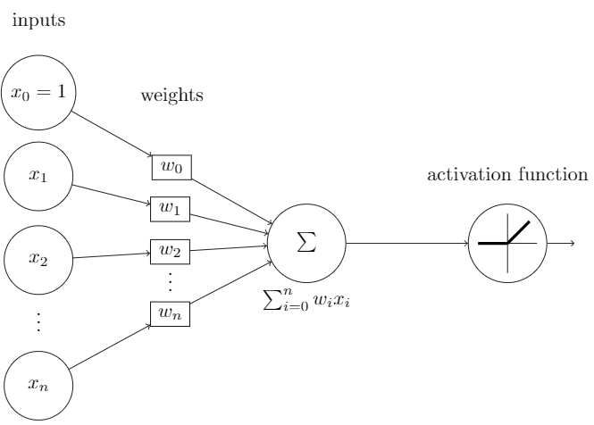
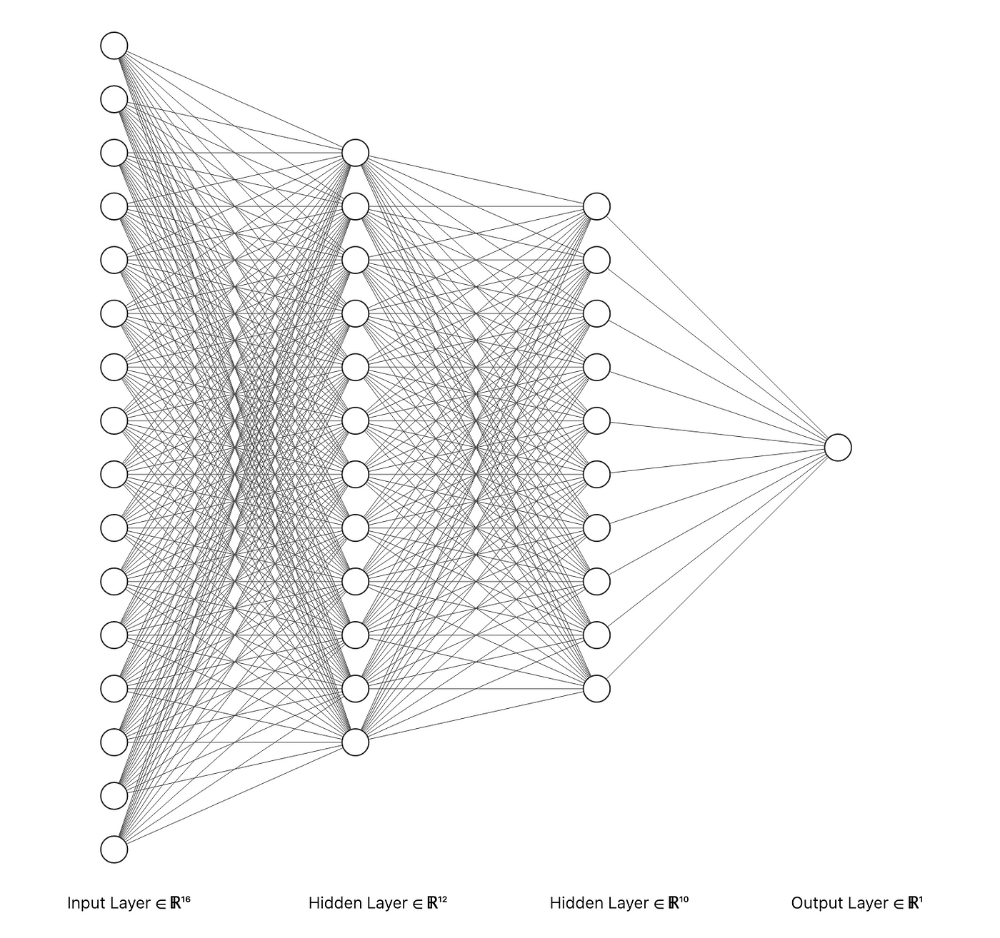

```{r setup, include = FALSE, message = FALSE}
knitr::opts_chunk$set(echo = TRUE)

# Packages


library(dslabs) # MNIST data
library(forcats) # Categorical data formatting
library(patchwork)
library(plotly) # Interactive data visualization
library(ggplot2) # Data visualization
library(Rtsne) # t-SNE
library(reticulate) # Python interfacing
```

```{python Python Packages, echo = FALSE}
import matplotlib.pyplot as plt # Data visualization
import numpy as np
import pandas as pd # Data frame manipulation
import sklearn.datasets as datasets # Datasets
```

# Background

## History

Artificial neural networks (ANNs), or neural networks for short, are some of
the most powerful methods in machine learning (ML). Neural networks were first 
hypothesized in the 1940s by Warren McCulloch and Walter Pitts but it wasn't 
until the late 1950s when Frank Rosenblatt created the the first ANN, the 
perceptron.

```{r Perceptron Figure, echo = FALSE, fig.align = "center", fig.cap = "A single perceptron unit."}

```

From the 1960s to the 2000s, the field of DL witnessed several landmark 
achievements:

- **1943**: Warren McCulloch and Walter Pitts hypothesize ANNs
- **1958**: Frank Rosenblatt develops the perceptron
- **1980**: Kunihiko Fukushima creates the neocognitron, the predecessor to the 
convolutional neural network
- **1971, 1982**: Paul Werbos, David Rummelhart and Geoffery Hinton 
independently develop the backpropagation algorithm to train multilayer 
perceptrons
- **1990**: Yann LeCun creates develops and applies the Convolutional Neural 
Network to handwritten digit recognition

Despite this, the field largely stagnated due to algorithmic, computational and 
data limitations of the time. It wasn't until the 2012 when Alex Krizhevsky, 
Ilya Sutskever and Geoffery Hinton published the famous "AlexNet" paper. Since 
then, DL has surged with ANNs steadily becoming the *de facto* method for 
solving large-scale problems in ML.

## Shortcomings

Despite their immense flexibility and seemingly "silver bullet"-nature, neural 
networks are highly unintepretable often being called "black box" models. 
"Black box" ML models refer to models for which data is input into the model 
and results are output, but the mechanics by which this happens is obscure and 
unintuitive. There is little to no understanding as to *what* the model is 
learning or what decisions are being made. As a result, explaining why a neural 
network makes a certain decision is unclear. 

Society is growing increasingly dependent on AI models and as they continue to 
permeate everyday life, the big question of what is happening "under-the-hood" 
in neural networks is becoming of serious concern.

# Objectives

In this article, we try and bring some much-needed transparency to the learning 
process of neural networks by visualizing the way ANNs learn. We will consider 
a simple multilayer perceptron tasked with classifying datapoints of different 
classes and examine how its decision boundaries and weights change over the 
course of the training process.By uncovering what happens during this learning 
process, we hope to turn AI models into explainable AI models to allow data 
scientists and end users to comprehend and trust the results of their 
models.

```{r Multilayer Perceptron, echo = FALSE, fig.align = "center", fig.cap = "A typical multilayer perceptron architecture consisting of an in input layer (left), an output layer (right) and any number of hidden layers in between."}

```

# Decision Boundaries

One of the best ways to understand how an ANN is able to classify datapoints is 
by understanding how they draw decision boundaries. A decision boundary is a 
surface that partitions the feature space into sets that optimally separate the 
classes which the network is trying to predict. Future points that the network 
has not seen will be classified into the corresponding region they fall into. 

```{r Decision Boundary, echo = FALSE, fig.align = "center", fig.cap = "A linear decsion boundary."}
knitr::include_graphics("../assets/Figures/Decision_Boundary.png")
```


## Mathematical Foundations

### Gradient Based Learning

ML predominantly revolves around a concept called gradient-based learning. In 
gradient-based learning, we reduced a complicated learning task (e.g., 
classification) that a human can perform down to a mathematical function called 
an objective function. This objective function compares the prediction made by 
the neural network against a reference/target value. Depending on how incorrect 
the prediction was, the network will return a single value that quantifies the 
performance of the network on that predicted value. This is referred to as a 
**loss**. In ML, objective functions are designed to be minimized. This makes 
sense as we want to *minimize* loss. The loss accumulated over all training 
datapoints is called the **cost**. 

For example, consider the Mean Squared Error cost function commonly used to 
train linear regression models. The larger the difference between the reference 
value(s) $\mathbf{y}$ and the predicted values $\mathbf{X}\boldsymbol{\beta}$, 
the larger the cost.

$$\underset{\boldsymbol{\beta}}{\text{arg min }} \mathcal{C}: \mathcal{C}(\beta_{0}, \beta_{1}) = \frac{1}{n} \left \lVert \mathbf{y} - \mathbf{X} \begin{bmatrix} \beta_{0} \\ \beta_{1} \end{bmatrix} \right \rVert_{2}$$

A key point to note is that the predicted value that cost functions use depend 
on the parameters of the model. By the Chain Rule of calculus, this means the 
entire cost function as a whole depends on the parameters of the model and thus 
can be *optimized* to find the best parameters for the model that minimize the 
cost.

### The Universal Approximation Theorem

The Universal Approximation Theorem is closely intertwined with gradient-based 
learning in the context of classification tasks. When it comes to 
classification, neural networks aim to learn a decision boundary that 
effectively separates different classes in the feature space. The theorem 
asserts that given a continuous function $f(x)$, there exists a neural network 
that with an arbitrary number of layers, neurons and type of activation 
function that can approximate this function to any desired degree of accuracy.

Gradient-based learning forms the backbone of training neural networks for 
classification tasks. This approach adjusts the parameters of the network 
iteratively by computing gradients of a cost function with respect to these 
parameters and updating them in the direction that minimizes the loss. The 
Universal Approximation Theorem supports this process by providing a 
theoretical guarantee that, with sufficiently large and appropriately 
configured networks, these gradients can guide the network towards 
approximating the true decision boundary between classes, enabling effective 
classification. This theorem fundamentally underpins the power and versatility 
of neural networks in approximating complex functions

## Example Datasets {.tabset}

To visualize how a neural network learns to separate two classes, we have
selected three datasets: `biclusters`, `circles` and `moons`. These synthetic
datasets were generated using the scikit-learn Python package. The two clusters
of `biclusters` can be optimally separated with a linear decision boundary
while the clusters in the other datasets require nonlinear boundaries.

### Biclusters

```{python Biclusters Data Generation, echo = FALSE}
biclustersData = datasets.make_blobs(n_samples = 500, n_features = 2,
	cluster_std = 2, centers = 2, shuffle = True, random_state = 42)
X = pd.DataFrame(biclustersData[0], columns = ['x', 'y'])
y = pd.DataFrame(biclustersData[1], columns = ["cluster"])
biclustersData = pd.concat([X, y], axis = 1)
biclustersData.to_csv("../assets/Datasets/biclusters.csv", sep = ',')

del(biclustersData, X, y)
```


```{r Biclusters Data Visualization, echo = FALSE, fig.align = "center", message = FALSE}
biclustersData <- readr::read_csv("../assets/Datasets/biclusters.csv")
biclustersData$cluster <- as.factor(biclustersData$cluster)

ggplot(biclustersData) +
	geom_point(aes(x, y, color = cluster)) +
	labs(title = "Biclusters Data",
		 subtitle = expression(italic('n')~" = "~500~", σ = 2"),
		 x = expression(italic('x')),
		 y = expression(italic('y')),
		 color = "Cluster",
		 caption = "Source: scikit-learn v1.4.2") +
	theme_bw()

rm(biclustersData)
```

<center>
<video width="910" height="720" controls>
  <source src="../assets/Decision-Boundaries/Biclusters/output.mp4" type="video/mp4">
</video>
</center>

### Circles

```{python Circles Data Generation, echo = FALSE}
circlesData = datasets.make_circles(n_samples = 500, shuffle = True, noise = 0.05, random_state = 42)
X = pd.DataFrame(circlesData[0], columns = ['x', 'y'])
y = pd.DataFrame(circlesData[1], columns = ["cluster"])
circlesData = pd.concat([X, y], axis = 1)
circlesData.to_csv("../assets/Datasets/circles.csv", sep = ',')

del(circlesData, X, y)
```

```{r Circles Data Visualization, echo = FALSE, fig.align = "center", message = FALSE}
circlesData <- readr::read_csv("../assets/Datasets/circles.csv")
circlesData$cluster <- as.factor(circlesData$cluster)

ggplot(circlesData) +
	geom_point(aes(x, y, color = cluster)) +
	labs(title = "Circles Data",
		 subtitle = expression(italic('n')~" = "~500~", σ = 0.05"),
		 x = expression(italic('x')),
		 y = expression(italic('y')),
		 color = "Cluster",
		 caption = "Source: scikit-learn v1.4.2") +
	theme_bw()

rm(circlesData)
```

<center>
<video width="910" height="720" controls>
  <source src="../assets/Decision-Boundaries/Circles/output.mp4" type="video/mp4">
</video>
</center>


### Moons

```{python Moons Data Generation, echo = FALSE}
moonsData = datasets.make_moons(n_samples = 500, shuffle = True, noise = 0.1,
	random_state = 42)
X = pd.DataFrame(moonsData[0], columns = ['x', 'y'])
y = pd.DataFrame(moonsData[1], columns = ["cluster"])
moonsData = pd.concat([X, y], axis = 1)
moonsData.to_csv("../assets/Datasets/moons.csv", sep = ',')

del(moonsData, X, y)
```

```{r Moons Data Visualization, echo = FALSE, fig.align = "center", message = FALSE}
moonsData <- readr::read_csv("../assets/Datasets/moons.csv")
moonsData$cluster <- as.factor(moonsData$cluster)

ggplot(moonsData) +
	geom_point(aes(x, y, color = cluster)) +
	labs(title = "Moons Data",
		 subtitle = expression(italic('n')~" = "~500~", σ = 0.1"),
		 x = expression(italic('x')),
		 y = expression(italic('y')),
		 color = "Cluster",
		 caption = "Source: scikit-learn v1.4.2") +
	theme_bw()

rm(moonsData)
```

<center>
<video width="910" height="720" controls>
  <source src="../assets/Decision-Boundaries/Moons/output.mp4" type="video/mp4">
</video>
</center>

# Weights and Biases

## MNIST {.tabset}

### Exploratory Data Analysis

```{r MNIST Data Preparation, echo = FALSE, eval = FALSE}
# DATA INGESTION
mnistData <- dslabs::read_mnist()

# DATA FORMATTING
mnistData$train$labels <- forcats::as_factor(mnistData$train$labels)
mnistData$test$labels <- forcats::as_factor(mnistData$train$labels)

saveRDS(mnistData, "../assets/Data-Objects/mnistData.rds")
```

#### Principal Components Analysis

```{r MNIST PCA, echo = FALSE}
mnistData <- readRDS("../assets/Data-Objects/mnistData.rds")
mnistPCA <- princomp(mnistData$train$images, cor = FALSE)
mnistPCA$scores <- as.data.frame(mnistPCA$scores)
PVE <- mnistPCA$sdev^2 / sum(mnistPCA$sdev^2) * 100
```

```{r MNIST PCA Biplot, echo = FALSE, fig.align = "center", fig.width = 9}
ggplot(mnistPCA$scores) + 
	geom_point(aes(Comp.1, Comp.2, color = mnistData$train$labels)) + 
	labs(title = "Biplot",
		 x = "Principal Component 1 (PVE = 9.7%)",
		 y = "Principal Component 2 (PVE = 7.1%)",
		 color = "Digit") + 
	theme_bw() + 
ggplot(mnistPCA$scores) + 
	geom_density_2d(aes(Comp.1, Comp.2, color = mnistData$train$labels)) + 
	labs(title = "Density Biplot",
		 x = "Principal Component 1 (PVE = 9.7%)",
		 y = "Principal Component 2 (PVE = 7.1%)",
		 color = "Digit") + 
	theme_bw() + 
patchwork::plot_layout(axes = "collect")
```

```{r MNIST PCA 3D Plot, echo = FALSE, fig.align = "center", fig.width = 9, warning = FALSE}
plotly::plot_ly(mnistPCA$scores, x = ~Comp.1, y = ~Comp.2, z = ~Comp.3, 
	type = "scatter3d", mode = "markers", color = mnistData$train$labels) |>
	plotly::layout(title = "\nPCA 3D Plot", 
		scene = list(xaxis = list(title = "PC 1 (PVE = 9.7%)"), 
		yaxis = list(title = "PC 2 (PVE = 7.1%)"),
		zaxis = list(title = "PC 3 (PVE = 6.2%)")))
```

It is evident that linear projections only capture some of the structure of the 
images and that we need to extend our dimensionality reduction efforts. To 
accomplish this, we will leverage the $t$-distributed Stochastic Neighbor 
Embedding ($t$-SNE) algorithm.

#### $t$-distributed Stochastic Neighbor Embedding

```{r MNIST t-SNE, echo = FALSE, eval = FALSE}
mnist2DTSNE <- Rtsne::Rtsne(mnistData$train$images, dims = 2, num_threads = 0)
saveRDS(mnist2DTSNE, "../assets/Data-Objects/tsne_2D_perplexity_30.rds")

mnist3DTSNE <- Rtsne::Rtsne(mnistData$train$images, dims = 3, num_threads = 0)
saveRDS(mnist3DTSNE, "../assets/Data-Objects/tsne_3D_perplexity_30.rds")
```

```{r MNIST t-SNE Biplots, echo = FALSE, fig.align = "center", fig.width = 9}
mnistTSNE <- readRDS("../assets/Data-Objects//tsne_2D_perplexity_30.rds")
ggplot(as.data.frame(mnistTSNE$Y)) + 
	geom_point(aes(V1, V2, color = mnistData$train$labels)) + 
	labs(title = "MNIST t-SNE Biplot",
		 x = 'x',
		 y = 'y',
		 color = "Digit") + 
	theme_bw() +
ggplot(as.data.frame(mnistTSNE$Y)) + 
	geom_density_2d(aes(V1, V2, color = mnistData$train$labels)) + 
	labs(title = "MNIST t-SNE Biplot",
		 x = 'x',
		 y = 'y',
		 color = "Digit") + 
	theme_bw() + 
patchwork::plot_layout(axes = "collect")
```

```{r MNIST t-SNE 3D Plot, echo = FALSE, fig.align = "center", fig.width = 9, warning = FALSE}
mnistTSNE <- readRDS("../assets/Data-Objects//tsne_3D_perplexity_30.rds")
plotly::plot_ly(as.data.frame(mnistTSNE$Y), x = ~V1, y = ~V2, z = ~V3, 
	type = "scatter3d", mode = "markers", color = mnistData$train$labels) |>
	plotly::layout(title = "\nt-SNE 3D Plot", 
	scene = list(xaxis = list(title = "Embedding Dimension 1"), 
	yaxis = list(title = "Embedding Dimension 2"),
	zaxis = list(title = "Embedding Dimension 3")))
```

### Entry to Hidden Layer 1

<center>
<video width="910" controls>
  <source src="../assets/Weights/Entry-HL1/output_compressed.mp4" type="video/mp4">
</video>
</center>

### Hidden Layer 1 into Hidden Layer 2

<center>
<video width="910" controls>
  <source src="../assets/Weights/HL1-HL2/output.mp4" type="video/mp4">
</video>
</center>
